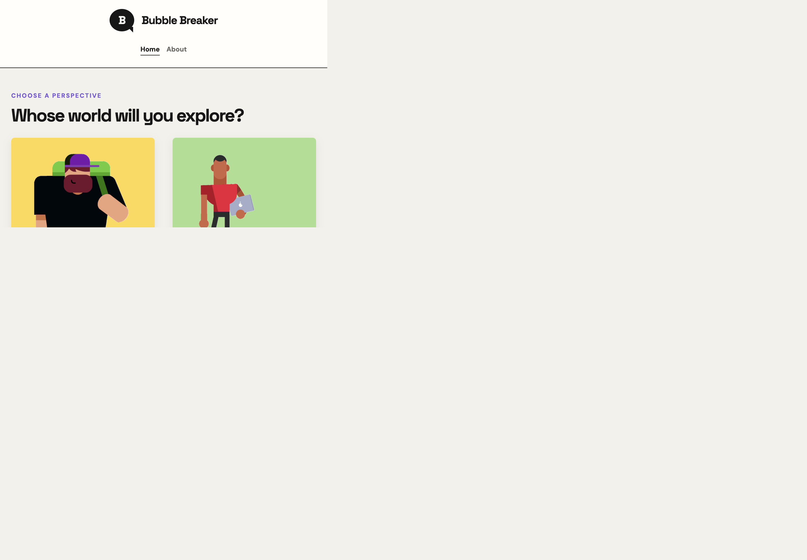
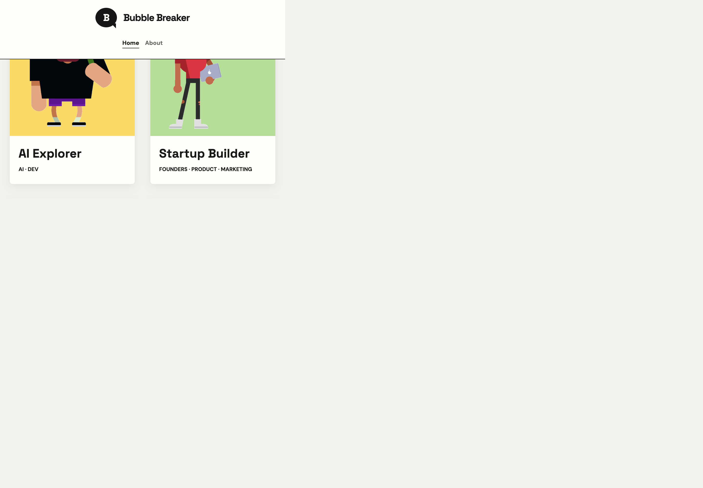
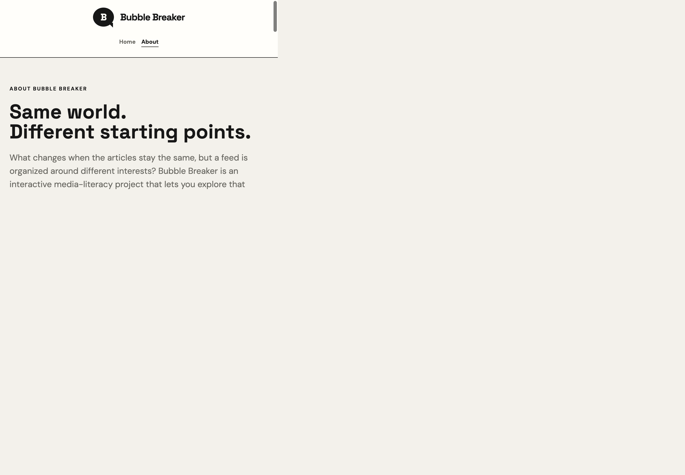

# Bubble Breaker

**An interactive media-literacy experience about personalized feeds and information bubbles.**

Bubble Breaker is a student portfolio project that makes recommendation patterns visible. Explore one fixed news dataset through four personas, inspect how each role's interests shape its feed, and compare that experience with a separate personal feed.

The interface is in English. Recommendation rules are deterministic and explained in the product; no account or backend is required.

## Experience

1. **Choose a role.** Start with AI Explorer, Startup Builder, Security Specialist, or Digital Creator.
2. **Explore its information bubble.** Each role has its own My Feed, My Analysis, and Break the Bubble views. Reading history and interest scores are isolated by role; switching roles never merges their profiles.
3. **Compare perspectives.** Inspect which categories appear in a role's feed and compare its recommendations with another role using the same dataset.
4. **Try a personal feed.** Build My Own Feed creates a separate personal context with its own reading history and recommendations.
5. **Learn about the experiment.** The top-level About page explains the project's purpose, model, and limitations.

## Screenshots

### Home: choose a perspective

The homepage puts the four role entry points first. Select a card to enter that role's independent experience.



### Persona feed: inspect one role's bubble

The role page pairs its character and interests with a feed explanation, Bubble Score, category controls, and recommendations.



### About: project purpose and methodology

The About page introduces the question, persona model, interaction flow, measurement limits, and local data handling.



## Navigation and Activity

The global navigation contains **Home** and **About**. After entering a persona or personal context, a secondary navigation group appears with **My Feed**, **My Analysis**, and **Break the Bubble**.

Each context keeps independent reading activity. Opening and saving stories while exploring AI Explorer changes only that role's profile. Switching to Startup Builder shows its own feed and analysis. The personal feed is separate from every persona. Saved status is shared across contexts, while interest points are attributed to the context where an article was saved.

## Recommendation Model

The project uses fixed, inspectable rules rather than a live recommender or AI model.

| Context | Behavior |
| --- | --- |
| Persona feed | Repeats a 70/30 mix: seven stories from that persona's interest categories and three from other categories. |
| Personal feed, before five interactions | Rotates across categories to establish an initial mix. |
| Personal feed, after five interactions | Prioritizes the two highest-scoring categories using the 70/30 pattern. Opens add one interest point; saving adds two; unsaving removes those two points. |
| Break the Bubble in a persona | Uses that role's categories as familiar topics, then targets a 40/40/20 mix of familiar, less-read, and remaining categories. |
| Break the Bubble in the personal context | Uses the personal profile's top categories. Before five opens, it falls back to a balanced category rotation. |

The **Bubble Score** looks at the latest ten article opens in the current context and reports the largest category share as a percentage. At least five opens are required. A concentration notice appears at 60 or above. Reopening a story counts as another reading event. This measures category concentration, not article quality or viewpoint diversity.

## Technology

- React 19 for the interactive interface
- Vite 8 for local development and production builds
- JavaScript ES modules and CSS
- Node.js built-in test runner and Oxlint
- Browser `localStorage` for context-scoped reading histories and saved stories

## Run Locally

Requirements: Node.js **22.12 or newer** and npm.

```bash
npm install
npm run dev
```

Open the local URL printed by Vite. To verify a production build:

```bash
npm test
npm run lint
npm run build
npm run preview
```

The production-ready static site is generated in `dist/` and can be deployed to any static hosting provider.

## Project Structure

```text
src/
	App.jsx                    Context state, navigation, and feed composition
	components/
		AnalysisPage.jsx          Context-scoped reading and interest analysis
		BubbleMeter.jsx           Bubble Score and reading concentration
		NewsCard.jsx              Article preview, save action, and source link
		PersonaBubble.jsx         Role-bubble explanation and feed comparison
		PersonaCard.jsx           Selectable persona card and portrait
	data/
		newsData.json             Fixed article dataset
		personas.js               Persona definitions, interests, and keywords
	utils/
		bubbleScore.js            Category distribution and Bubble Score
		recommendation.js         Feed ordering and category blending
		storage.js                Validated context activity and legacy migration
```

## Data and Privacy

- The app uses a fixed local article dataset; it does not fetch a live news feed.
- Reading history and interest scores for each role and the personal context stay in this browser under `bubbleBreakerUserData`.
- There is no sign-in, application server, analytics service, or AI service.
- Article links open their original sources. When an article has no supplied cover image, the card may request a preview image from Microlink.
- All local progress can be cleared from **My Analysis** with **Reset My Data**.

## Scope

Bubble Breaker is an educational simulation. Its feeds model topic concentration and ranking order; they do not claim to determine the political, factual, or ideological diversity of an article set. The fixed dataset and recommendation rules are intentionally bounded so the experience can be inspected and discussed in a classroom.
