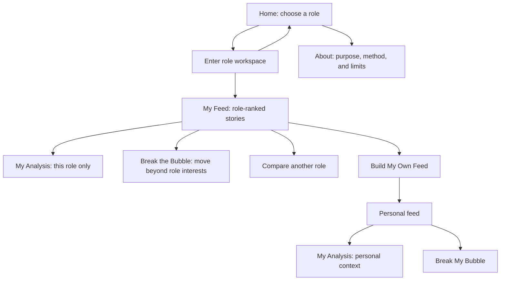
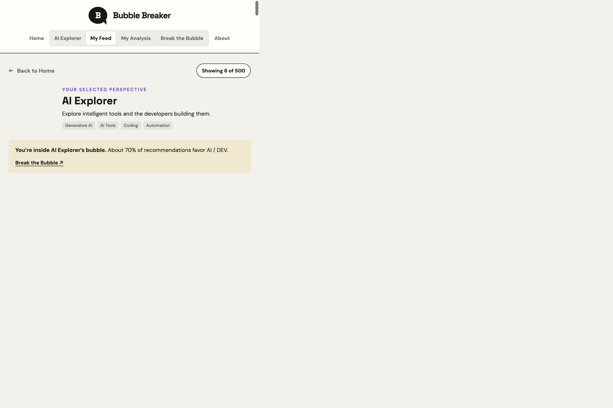
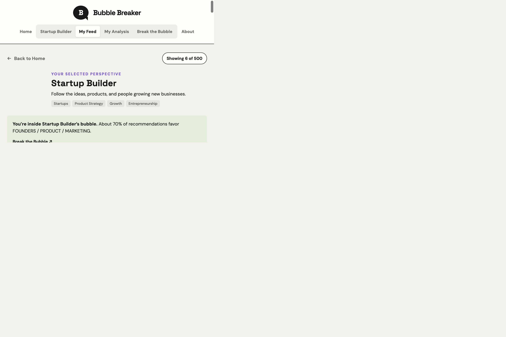
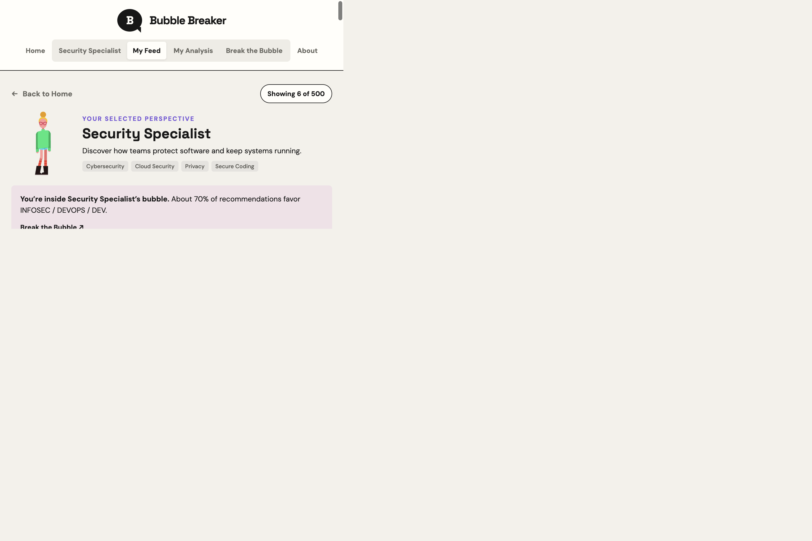
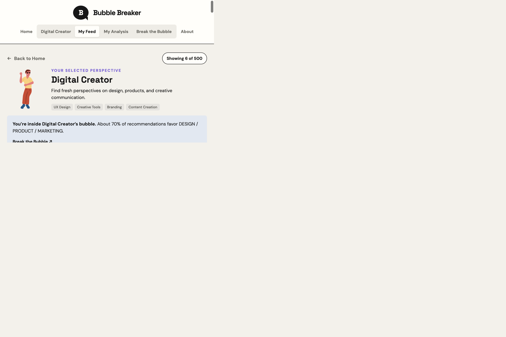
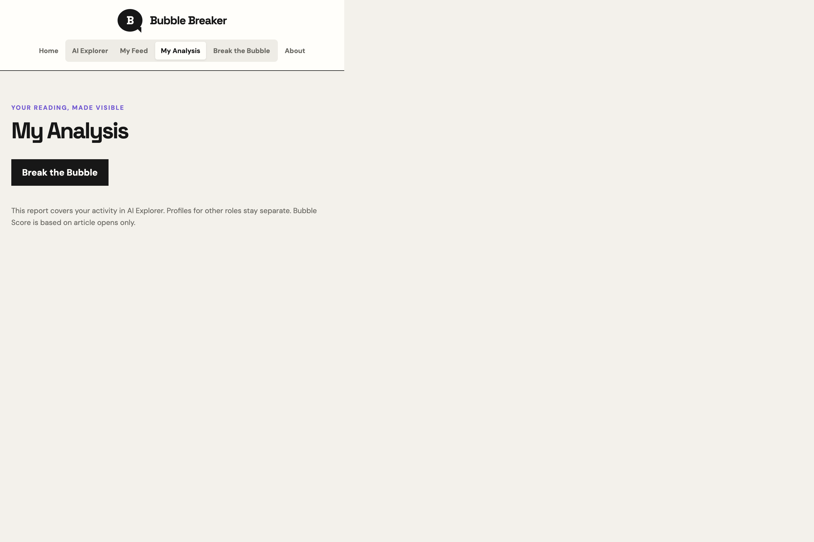
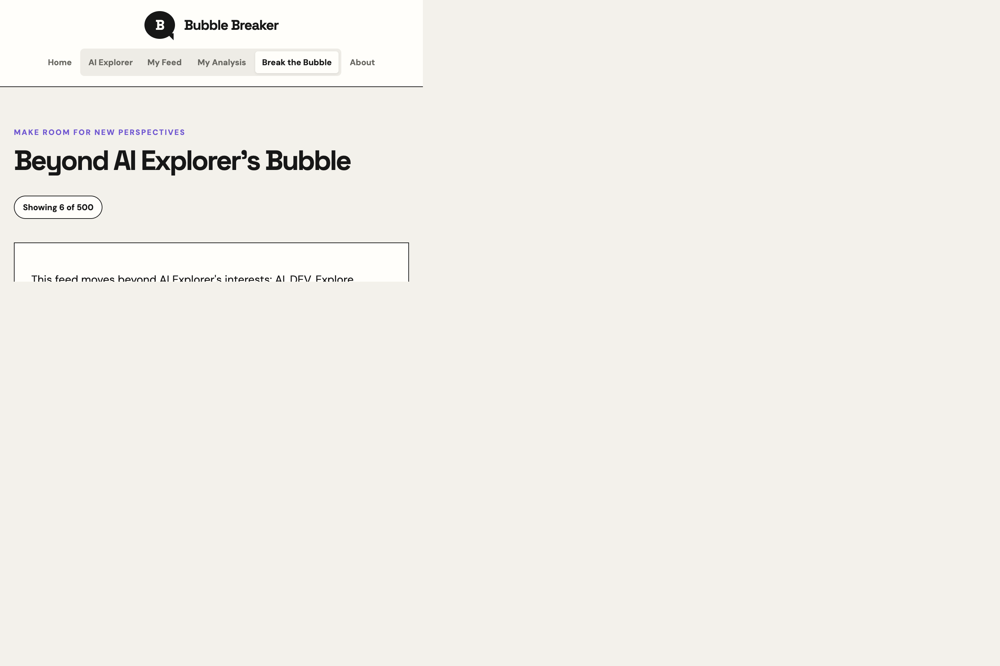
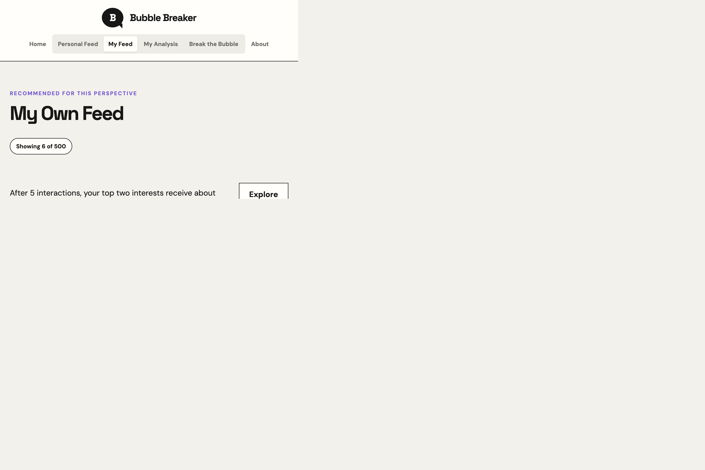

# Bubble Breaker

**An interactive media-literacy experience about personalized feeds and information bubbles.**

Bubble Breaker is a browser-based media-literacy experience for examining how interest-driven ranking shapes the news people encounter. Using one fixed collection of 500 articles, it compares four role-based feeds, keeps each role's reading profile independent, and provides a separate personal feed.

The product combines an interactive recommendation model, context-scoped reading analysis, and a guided way to explore content beyond a selected role. Its rules are deterministic and inspectable; it requires no account or backend.

## Contents

- [User Flow](#user-flow)
- [Key Features](#key-features)
- [How It Works](#how-it-works)
- [Tech Stack](#tech-stack)
- [Project Structure](#project-structure)
- [Run Locally](#run-locally)
- [Data, Privacy, and Limitations](#data-privacy-and-limitations)

## User Flow



The global navigation contains **Home** and **About**. Once a role or the personal context is active, **My Feed**, **My Analysis**, and **Break the Bubble** appear together as that context's sub-navigation.

## Key Features

### Home: role selection

The homepage introduces the four available perspectives. Selecting a role opens its workspace; switching roles changes the active lens without merging its reading profile with another role.


### Persona workspaces

All roles use the same articles, but their interests determine which stories are surfaced first. Each role has an independent My Feed, My Analysis, and Break the Bubble experience.

| AI Explorer | Startup Builder |
| --- | --- |
|  |  |

| Security Specialist | Digital Creator |
| --- | --- |
|  |  |

### My Analysis: role-scoped reading profile

My Analysis summarizes article opens, saves, category interest points, recent reading, and Bubble Score for the active role. Each persona's profile is kept separate from the others and from the personal context.



### Break the Bubble: go beyond role interests

The role-specific break feed starts from the active persona's interests, then allocates recommendations to less-read and remaining categories. Its purpose is to make the role's ranking boundary visible and offer a concrete alternative.



### My Own Feed: a separate personal context

My Own Feed builds a separate reading profile from the reader's own opens and saves. It does not inherit the most recently selected persona's interest scores.



### About: purpose, method, and limitations

The About page explains the central question, the four personas, the user flow, the Bubble Score, data handling, and what this simulation does not measure.


## How It Works

Each role has separate reading history and interest scores. Switching roles does not merge profiles. The personal context is separate from all personas. Saved status is shared across contexts, while interest points are attributed to the context where an article was saved. Legacy browser activity is migrated to the personal context.

| Context | Recommendation behavior |
| --- | --- |
| Persona feed | Repeats a 70/30 mix: seven stories from the role's interest categories and three from other categories. |
| Personal feed, before five interactions | Rotates across categories to establish an initial mix. |
| Personal feed, after five interactions | Prioritizes the two highest-scoring categories using the 70/30 pattern. Opens add one interest point; saving adds two; unsaving removes those two points. |
| Break the Bubble in a role | Uses that role's categories as familiar topics, then targets a 40/40/20 mix of familiar, less-read, and remaining categories. |
| Break My Bubble in the personal context | Uses the personal profile's top categories. Before five opens, it falls back to a balanced category rotation. |

The **Bubble Score** uses the latest ten article opens in the active context and reports the largest category share. At least five opens are needed. A concentration notice appears at 60 or above. Reopening a story counts as another event. The score measures topic concentration, not article quality, factual accuracy, or viewpoint diversity.

## Tech Stack

| Layer | Technology | Role in the project |
| --- | --- | --- |
| UI | React 19, JSX, CSS | Persona workspaces, navigation, analysis views, and responsive presentation. |
| Development and build | Vite 8, `@vitejs/plugin-react` | Local development server, hot updates, and static production builds. |
| Application logic | JavaScript ES modules | Deterministic feed ordering, category blending, Bubble Score, and context-scoped state. |
| Dataset | Local JSON | A fixed collection of 500 articles and four persona definitions. |
| Persistence | Browser `localStorage` | Reading history, per-context interest scores, and saved article state. |
| Quality checks | Node.js `node:test`, Oxlint | Unit tests for recommendation/storage behavior and static linting. |

The production output is a static site. There is no API server, database, account system, or AI dependency.

## Project Structure

```text
.
├── docs/
│   └── screenshots/
│       ├── about.png
│       ├── ai-explorer.png
│       ├── break-bubble.png
│       ├── digital-creator.png
│       ├── home.png
│       ├── my-analysis.png
│       ├── persona-feed.png
│       ├── personal-feed.png
│       ├── security-specialist.png
│       └── startup-builder.png
├── public/
│   ├── bubble-breaker.svg
│   └── icons.svg
├── src/
│   ├── App.jsx                  Context state, navigation, and feed composition
│   ├── main.jsx                 React entry point
│   ├── index.css                Base document styles
│   ├── styles.css               Application and responsive styles
│   ├── assets/
│   │   ├── ai-explorer.gif
│   │   ├── bd041164212061.5acb40715dc90.gif
│   │   ├── digital-creator.gif
│   │   ├── hero.png
│   │   ├── security-specialist.gif
│   │   ├── startup-builder.gif
│   │   ├── react.svg
│   │   └── vite.svg
│   ├── components/
│   │   ├── AnalysisPage.jsx     Context-scoped activity and score analysis
│   │   ├── BubbleMeter.jsx      Bubble Score and concentration feedback
│   │   ├── NewsCard.jsx         Article preview, save action, and source link
│   │   ├── PersonaBubble.jsx    Role-bubble explanation and comparison
│   │   └── PersonaCard.jsx      Selectable role card and portrait
│   ├── data/
│   │   ├── newsData.json        Fixed 500-article dataset
│   │   └── personas.js          Role interests, keywords, and descriptions
│   └── utils/
│       ├── bubbleScore.js       Category distribution and Bubble Score
│       ├── recommendation.js   Deterministic feed ordering and blending
│       ├── recommendation.test.js
│       └── storage.js           Context-scoped activity and legacy migration
├── index.html                   Page title, description, and social metadata
├── .gitignore
├── .nvmrc
├── .oxlintrc.json
├── package.json                 Scripts and dependencies
├── package-lock.json
└── vite.config.js               Vite configuration
```

## Run Locally

Requirements: Node.js **22.12 or newer** and npm.

```bash
npm install
npm run dev
```

Open the local URL printed by Vite. Run checks and create a production build with:

```bash
npm test
npm run lint
npm run build
npm run preview
```

The static production site is generated in `dist/` and can be deployed to any static hosting provider.

## Data, Privacy, and Limitations

- The app uses a fixed local dataset; it does not fetch a live news feed.
- Reading history, interest scores, and saved-story state are stored in this browser under `bubbleBreakerUserData`.
- There is no sign-in, application server, analytics service, or AI recommender.
- Article links open their original sources. When no cover image is supplied, a preview image may be requested from Microlink.
- All local progress can be cleared from **My Analysis** with **Reset My Data**.
- Category balance is a teaching proxy. The project does not assess factual quality or the diversity of viewpoints within a category.
